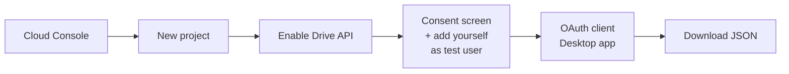

# Open in Google

I don't have Microsoft 365. So every time someone sent me an `.xlsx`, or LLMs generated one for me, I did the same stupid dance: open drive.google.com, New → File upload, wait, right-click → Open with Sheets. Six clicks just to take a deeper look at a spreadsheet. And lately it's gotten worse, because now the LLMs spit out CSVs and spreadsheets constantly, and every single one means doing that dance again.

So I built the thing I wanted: right-click the file → "Open in Google Sheets." Done. And with full Google Storage & Privacy control.

## What it does

Right-click any Excel, CSV, Word, or PowerPoint file on Windows. It uploads to a folder in your Google Drive, converts it, and opens it in Sheets / Docs / Slides in your browser.

Open the same file again next week and it updates that Drive copy instead of making a second one. Rename the file and it starts fresh. New name, new Drive file, which is what you'd expect.

`.xlsx` `.xls` `.csv` → Sheets · `.docx` `.doc` → Docs · `.pptx` `.ppt` → Slides

## Why this and not something else

Some differentiators for the curious:

- Works wherever the file lands. Downloads folder, Desktop, an email attachment you saved. No special folder, no dragging files into a browser.
- No sync client, no default-app change. You don't install a background sync app, and you don't change what opens your files.
- One right-click, native result. It converts to real Google Sheets / Docs / Slides, so add-ons, Apps Script and Google's other native features work.
- Nothing runs between clicks. It only runs when you right-click, and it only uploads the one file you right-clicked. Good if you care about storage and privacy (I do 🥳).

## When you don't need this: 
If you only want to view or lightly edit a file AND send it back as an .xlsx, Google's own tools can edit Office files in their original format and save back to it. This tool is for when you want the file to be a part of your Google workspace.

## Setup

Two parts, about ten minutes, once ever.

**Part 1: Give the app a Google credential (5 min).** Google doesn't let any app touch your Drive without one, so you create it in your own account. Free, and the app only ever gets permission to touch files it created itself. The rest of your Drive stays invisible to it.



The click-by-click version is in [SETUP.md](SETUP.md).

**Part 2: Install on Windows (2 min).** Grab `open-in-google.zip` from [Releases](../../releases), extract it anywhere, open PowerShell in that folder:

```powershell
powershell -ExecutionPolicy Bypass -File .\Install.ps1 -ClientJson "$env:USERPROFILE\Downloads\client_secret_*.apps.googleusercontent.com.json"
```

Right-click a spreadsheet → Open in Google Sheets. Your browser asks you to sign in once; you never see it again. No admin rights needed.

## Privacy

- This talks only to Google's APIs, straight from your PC. No server, no analytics, no account with anyone.
- Your sign-in tokens are encrypted by Windows and never leave your machine.
- It's three small scripts. Read them. That's the whole point of open source.

## Things it doesn't do

- Edits you make in the browser don't sync back to the file on your disk. The local file is the source; Drive is where you view and edit.
- It needs internet to upload, obviously. After that it's just a Google doc.

## If you hate it

Run `Uninstall.ps1`. The right-click entries disappear; your Drive files stay where they are. Add `-RemoveAppData` to wipe the saved login too.

## License

MIT. See [LICENSE](LICENSE).
