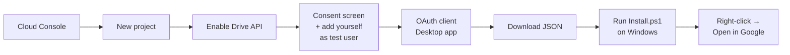

# Open in Google: Setup Guide

Right-click any `.xlsx` / `.xls` / `.csv` / `.docx` / `.doc` / `.pptx` / `.ppt`
file **anywhere** on your Windows PC and open it directly in Google Sheets,
Docs, or Slides. The file is uploaded to your Google Drive (converted to the
native Google format) and the editor opens in your browser.

One-time setup takes about 10 minutes and has two parts. Here's the map:



No admin rights needed on Windows.

---

## Part 1: Create the Google credentials (one time)

Google requires every app that touches Drive to identify itself, so you create
a free credential for this little tool in your own Google account. Nothing is
shared with anyone.

1. Go to [console.cloud.google.com](https://console.cloud.google.com/) and sign
   in with the Google account you want the files to land in.
2. **Create a project:** top bar project picker → *New Project* → name it
   `OpenInGoogle` → *Create*. Wait for it to finish, then select it.
3. **Enable the Drive API:** left menu → *APIs & Services* → *Library* →
   search **Google Drive API** → *Enable*.
4. **Consent screen:** *APIs & Services* → *OAuth consent screen* →
   User type **External** → *Create*.
   - App name: `OpenInGoogle`
   - User support email: your email
   - Developer contact: your email
   - *Save and Continue* through Scopes (adding the scope below is optional
     but recommended: *Add or Remove Scopes* → paste
     `https://www.googleapis.com/auth/drive.file` → *Update* → *Save*).
   - **Test users** → *Add Users* → add your own Gmail address → *Save*.
     (This keeps Google from showing an "unverified app" warning to you.)
5. **Create the credential:** *APIs & Services* → *Credentials* →
   *Create Credentials* → **OAuth client ID** → Application type:
   **Desktop app** → name it `OpenInGoogle desktop` → *Create* →
   **Download JSON**. Save the file somewhere you can find it, e.g.
   your Downloads folder.

## Part 2: Install on Windows (one time)

1. Extract the `open-in-google.zip` from this folder anywhere, e.g.
   `C:\Tools\open-in-google`.
2. Open PowerShell **in that folder** (Shift + right-click the folder →
   *Open PowerShell window here*, or type `powershell` in the File Explorer
   address bar and hit Enter).
3. Run (replace the path with where your JSON actually is):

```powershell
powershell -ExecutionPolicy Bypass -File .\Install.ps1 -ClientJson "$env:USERPROFILE\Downloads\client_secret_*.apps.googleusercontent.com.json"
```

   Note: PowerShell expands the `*` wildcard, so the above works even with
   the long random filename Google gives the JSON.

4. Done. No restart needed.

## Part 3: Use it

Right-click any Excel, CSV, Word, or PowerPoint file → **Open in Google
Sheets / Docs / Slides**.

- The **first** run opens your browser once for Google sign-in. Approve, and
  the file opens right after. You won't be asked again (the sign-in token is
  stored encrypted on your PC).
- Files land in a Google Drive folder called **OpenInGoogle**.
- Opening the **same file** again updates the existing Drive file instead of
  creating a duplicate. (The tool remembers which Drive file each local file
  maps to, in `%LOCALAPPDATA%\OpenInGoogle\filemap.json`.)
- **Renaming** the local file starts fresh: it uploads as a new Drive file
  under the new name. The old Drive copy stays where it was. Delete it yourself if you don't want it.

## Troubleshooting

- **Nothing happens / error popup:** details are logged to
  `%LOCALAPPDATA%\OpenInGoogle\open-in-google.log`. Paste the last lines to
  your assistant for help.
- **"Not set up yet":** re-run `Install.ps1` with `-ClientJson` (Part 2.3).
- **Duplicate files piling up in Drive:** fixed in the current version.
  Re-extract the zip over your install folder (your sign-in is kept, no need
  to redo Part 1), then delete the extra copies from the OpenInGoogle folder
  in Drive. Re-opening a file now updates its Drive copy in place.
- **Want it gone:** run `.\Uninstall.ps1` from the same folder (add
  `-RemoveAppData` to also delete the saved sign-in).

## How it works (short version)

`Install.ps1` registers a per-user context-menu entry (`HKCU\...\SystemFileAssociations`)
for each Office extension. No admin rights needed. The menu launches
`Open-InGoogle.ps1`, which authenticates with Google via OAuth (loopback on
127.0.0.1, tokens encrypted with Windows DPAPI), uploads the file to Drive
with conversion to the native Google format (resumable upload), and opens the
`docs.google.com/.../edit` URL in your default browser. The app only ever gets
`drive.file` scope: it can touch only files it created itself, nothing else in
your Drive.
